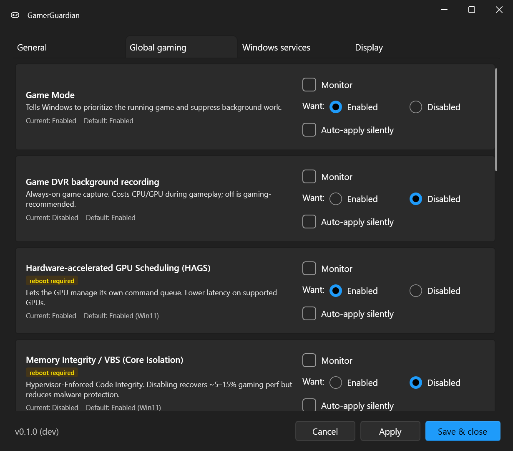

# GamerTune

A lightweight Windows 11 tray app that watches gaming-related display and system settings, alerts you (or auto-fixes) when they drift from your preferences, and stays out of the way during gameplay and benchmarks.

[Install](https://github.com/gamertune/gamertuneapp/wiki/Installation) · [Build](https://github.com/gamertune/gamertuneapp/wiki/Build-from-source) · [Verification](https://github.com/gamertune/gamertuneapp/wiki/Verification) · [Logging](https://github.com/gamertune/gamertuneapp/wiki/Logging) · [Security](https://github.com/gamertune/gamertuneapp/wiki/Security)

---

## Why this exists

If you've ever fired up a game and realized 30 minutes later that HDR turned itself off after the last driver update, or that you've been gaming at 60 Hz instead of your monitor's actual max — GamerTune is for that. It periodically compares Windows settings against your preferences and either prompts you to fix drift in one click, or silently corrects it in the background.

It's also paranoid about not making your gaming worse. Polling pauses entirely during fullscreen games (including borderless windowed) and benchmark runs. Working set is trimmed back to ~25 MB at idle. No process spawning, no kernel hooks, no DPC callbacks.

## Highlights

- 🎯 **29+ monitored settings** spanning display, security, performance, capture, input, privacy/telemetry, network latency, system tuning, and Windows services
- ⚙️ **Three one-click presets** on the General tab -- **Apply recommended** (safe gaming preset: keeps Memory Integrity / VBS on, leaves contested network tweaks to you), **Apply extreme** (every gaming tweak on, including Memory Integrity / VBS off and the contested Nagle / NIC tweaks, with Monitor + Auto-apply on for every setting — confirms first), and **Reset all to defaults** (stages everything back to Windows defaults). The recommended preset is idempotent, so re-running it after a future update picks up only the new settings.
- 🎮 **Pauses during gameplay** — fullscreen, borderless, *and* during benchmark runs (3DMark, Cinebench, Geekbench, etc.)
- ⚡ **One-click apply** with a per-setting auto-apply opt-in
- 🪟 **Native Win11 Fluent design** with light / dark / system themes
- 🔄 **Auto-update** — checks GitHub Releases on startup, one-click install
- 🪶 **~23 MB idle working set**, ~10 ms per polling tick

## Screenshot

*Settings → Global gaming tab. Each card shows the setting name, a short description, current value, Windows default, and per-setting Monitor / Want / Auto-apply controls. Reboot-required settings get a yellow badge. The other tabs cover General preferences (three one-click presets), **Privacy** (Advertising ID, Activity History, Cross-Device Platform, Tailored experiences, speech, inking), **Debloat** (ads / nags / suggested content), **Network** (Nagle's algorithm, NIC power management), Windows services, Windows AI, per-display Display settings (HDR / refresh / DRR), and CPU / Power.*

## What it watches

For each setting you choose three things: **Monitor** (watch it or not), the **desired value** (**Want** — shown as Enabled/Disabled, or Gaming/Default where the registry meaning is inverted), and whether to **auto-apply silently** when it drifts. Changes are staged until you click **Apply**, every change is reversible, and each one is recorded in `changes.log`.

Settings live across **ten tabs**. The lists below cover the monitored settings; for a complete walkthrough of every tab and what each setting means, see the **[Settings & tabs guide](https://github.com/gamertune/gamertuneapp/wiki/Settings-and-tabs)** (and [SETTINGS-REFERENCE.md](docs/SETTINGS-REFERENCE.md) for the full per-setting reference).

- **General** — theme, launch-at-startup, polling interval, update check, change log, and the **three one-click preset buttons** (Apply recommended / Apply extreme / Reset all to defaults) that stage a whole-app config across every tab.
- **Global gaming**, **Privacy**, **Debloat**, **Network**, **Windows services**, **Windows AI**, **Display** — the monitored settings, listed below.
- **CPU / Power** — detected CPU, **Power Throttling**, a CPU-aware custom gaming **power plan** (Balanced clone tuned for your CPU — e.g. X3D core-parking), and dual-CCD routing prerequisites. See [CPU-aware power plans](https://github.com/gamertune/gamertuneapp/wiki/CPU-Power-Plans).
- **Recommended BIOS** — a firmware checklist (Resizable BAR, XMP/EXPO, CPPC mode, etc.); guidance only, nothing is changed.

### Per-display

| Setting | Notes |
|---|---|
| [**HDR**](https://support.microsoft.com/en-us/windows/hdr-settings-in-windows-2d767185-38ec-7fdc-6f97-bbc6c5ef24e6) | On/off via Windows Display Configuration (CCD) API |
| [**Refresh rate**](https://support.microsoft.com/en-us/windows/change-the-refresh-rate-on-your-monitor-in-windows-c8ea729e-0678-015c-c415-f806f04aae5a) | Maximum supported, or pin a specific Hz |
| [**Resolution**](https://support.microsoft.com/en-us/windows/change-your-screen-resolution-and-layout-in-windows-5effefe3-2eac-e306-0b5d-2073b765876b) | Pin to a specific resolution (opt-in) |
| [**Dynamic Refresh Rate (DRR)**](https://devblogs.microsoft.com/directx/dynamic-refresh-rate/) | Win11 22H2+ content-based refresh boost via the CCD API. Shows "not supported" on panels that lack it. Distinct from VRR. |

### Global gaming settings

| Setting | What it does | Reboot |
|---|---|:---:|
| [**HAGS**](https://devblogs.microsoft.com/directx/hardware-accelerated-gpu-scheduling/) | Lets the GPU manage its own command queue. Lower latency on supported GPUs. | ✓ |
| [**Memory Integrity / VBS**](https://support.microsoft.com/en-us/windows/core-isolation-e30ed737-17d8-42f3-a2a9-87521df09b78) | HVCI. Disabling recovers ~5–15% gaming perf at the cost of reduced malware protection. | ✓ |
| [**Virtualization-Based Security (full stack)**](https://learn.microsoft.com/en-us/windows/security/hardware-security/enable-virtualization-based-protection-of-code-integrity) | Superset of Memory Integrity: disables every VBS scenario (HVCI, Credential Guard, System Guard, kernel stack protection) plus the policy keys Windows uses to re-enable them. Registry-only — WSL2/Docker keep working. Breaks Valorant. | ✓ |
| [**Game Mode**](https://support.xbox.com/en-US/help/games-apps/game-setup-and-play/use-game-mode-gaming-on-pc) | Tells Windows to prioritize the running game and suppress background work. | |
| [**Game DVR background recording**](https://support.xbox.com/help/games-apps/game-dvr/game-dvr-windows-10) | Always-on game capture. Costs CPU/GPU during gameplay. | |
| [**Mouse "Enhance pointer precision"**](https://support.microsoft.com/en-us/windows/change-mouse-settings-e81356a4-0e74-fe38-7d01-9d79fbf8712b) | Acceleration curve applied to mouse movement. | |
| [**Fullscreen optimizations**](https://devblogs.microsoft.com/directx/demystifying-full-screen-optimizations/) | Borderless-windowed compositing layer for fullscreen apps. | |
| [**Variable Refresh Rate (DirectX)**](https://devblogs.microsoft.com/directx/os-variable-refresh-rate/) | G-Sync / FreeSync compatibility flag. Not the same as Dynamic Refresh Rate (DRR). | |
| [**Power plan**](https://learn.microsoft.com/en-us/windows-hardware/customize/power-settings/configure-power-settings) | Active Windows power scheme. | |
| [**System Responsiveness**](https://learn.microsoft.com/en-us/windows/win32/procthread/multimedia-class-scheduler-service) | MMCSS reservation percentage. | ✓ |
| [**USB Selective Suspend**](https://learn.microsoft.com/en-us/windows-hardware/drivers/usbcon/usb-selective-suspend) | Lets Windows suspend idle USB devices. | ✓ |
| [**Games multimedia task profile**](https://learn.microsoft.com/en-us/windows/win32/procthread/multimedia-class-scheduler-service) | Priority + scheduling values for the MMCSS Games task. | |
| [**Power Throttling**](https://learn.microsoft.com/en-us/windows/win32/power/power-throttling) | Disables OS throttling of background threads for sustained performance (CPU / Power tab). | |
| [**Fast Startup (hybrid boot)**](https://learn.microsoft.com/en-us/troubleshoot/windows-client/performance/fast-startup-and-hybrid-boot) | Off makes every shutdown a true cold boot; fixes stale driver/USB state. | ✓ |
| **Visual effects (best performance)** | Disables Windows UI animations/effects for a snappier desktop. | |

### Privacy

Telemetry/privacy toggles Windows often re-enables after feature updates -- the drift-guard re-asserts your choice. **Advertising ID** and **Tailored experiences** (per-user, HKCU); **Cross-Device Platform** and **Activity History / Timeline** (HKLM policy). Each is monitored against your preference and reversible. See the [Privacy section of SETTINGS-REFERENCE.md](docs/SETTINGS-REFERENCE.md#privacy).

### Network

Network-latency tweaks. **Network Throttling** (MMCSS packet pacing) is a safe, well-established tweak. **Nagle's algorithm** (per-interface TCP no-delay) and **NIC power management** (stops Windows from powering down the adapter) are contested -- their benefit varies by hardware and can make some connections *worse*, so read each Learn more and revert if latency degrades. All three ship at full monitor / desired / auto-apply parity. See the [Network section of SETTINGS-REFERENCE.md](docs/SETTINGS-REFERENCE.md#network).

### Windows services

A curated catalog of services GamerTune can stop + disable (or set to Manual). One-click "Gaming optimized" preset, plus per-service Default/Manual/Disabled. Includes `DiagTrack` (telemetry), `MapsBroker`, `Fax`, `lfsvc` (Geolocation), `wisvc` (Windows Insider), Xbox services, `DoSvc` (Delivery Optimization), `iphlpsvc` (IP Helper), `RemoteAccess` / `RemoteRegistry` (drift-confirm), and more. See [`ServiceCatalog.cs`](src/GamerTune/Services/ServiceCatalog.cs) for the full list.

### Windows AI

Policy-toggle disables for Copilot, Recall, Click-to-Do, Edge Copilot/Hubs/GenAI, Notepad Rewrite / Paint AI, Windows search AI suggestions, Windows AI Actions (right-click rewrite/summarize), typing-data harvesting, and Microsoft 365 Copilot in Word/Excel/OneNote. Optional one-way removal of Windows AI UWP packages (`Microsoft.Copilot`, `Microsoft.Windows.Ai.Copilot.Provider`, `MicrosoftWindows.Client.AIX`) and service disables for `WSAIFabricSvc` + `AarSvc`. Inspired by [zoicware/RemoveWindowsAI](https://github.com/zoicware/RemoveWindowsAI) but stays in the safe "policy toggle + service disable + opt-in UWP removal" lane -- every change is reversed by deleting the same registry value or re-enabling the service. Walk-through in the [Windows AI section of SETTINGS-REFERENCE.md](docs/SETTINGS-REFERENCE.md#windows-ai-policies).

## Performance & gaming impact

Designed to be invisible during gameplay.

- **~23 MB working set** at idle, **~10 ms** per polling tick. Only the four display settings (HDR, refresh rate, resolution, DRR) are polled on the fast interval (default 30 s); the ~40 set-and-forget registry / policy / service settings are re-checked at startup, on resume / unlock / display-change events, and on a slow 10-minute backstop instead — so the fast tick does almost nothing most of the time.
- **Pauses entirely** during fullscreen games, borderless-fullscreen games, and known benchmarks (3DMark, Cinebench, Geekbench, AIDA64, Unigine, OCCT, etc.).
- **No process spawning** for reads. Power plan reads/writes go through `powrprof.dll` directly.
- **No kernel hooks, no drivers, no admin** — only HKLM writes need elevation, which prompts UAC.

Memory + pause-detection details: [Build from source](https://github.com/gamertune/gamertuneapp/wiki/Build-from-source) (CI build flags) and [`MonitorService.cs`](src/GamerTune/Services/MonitorService.cs).

## How it works

Pure user-mode P/Invoke. Each monitored setting is an `IMonitoredSetting` implementation in [`src/GamerTune/Monitors/`](src/GamerTune/Monitors/) — adding a new one is ~30 lines. Full source-file reference: [Source file reference](https://github.com/gamertune/gamertuneapp/wiki/Source-file-reference).

| API surface | Used for |
|---|---|
| Connecting and Configuring Displays (CCD) | HDR state, VRR, display enumeration |
| `EnumDisplaySettingsEx` / `ChangeDisplaySettingsEx` | Refresh rate, resolution |
| `powrprof.dll` | Power plan |
| `SystemParametersInfo` | Mouse precision |
| Direct `HKCU` / `HKLM` registry access | All registry-backed settings |
| `sc.exe` (via `Verb=runas`) | Windows service start type + stop |
| `SHQueryUserNotificationState` | Fullscreen game / presentation detection |
| `Process.GetProcesses` | Benchmark detection |
| `EmptyWorkingSet` (psapi) | Working-set trimming |

## Verification

GamerTune doesn't ask you to take its word for it. Independent ways to confirm what it's doing — see [Verification](https://github.com/gamertune/gamertuneapp/wiki/Verification) for the full rundown:

1. The Settings UI re-reads from the OS after every Apply
2. The Apply Results window shows before / target / after for each setting
3. The footer **Verify all** button re-reads every monitored setting and writes a `[SNAPSHOT]` to `changes.log` -- nothing is applied
4. Every change writes a copy-pasteable PowerShell **apply** and **verify** command to [`changes.log`](https://github.com/gamertune/gamertuneapp/wiki/Logging)
5. Verbose log lines include `[SESSION]` (version + OS + elevation), `[APPLY-START]` / per-change record / `[APPLY-END]`, `[EXTRESET]` (Windows reverted a value we'd applied), `[CIRCUIT]` (the auto-apply circuit breaker stopped re-applying a setting Windows keeps reverting, so a stubborn GPO-managed value can't trigger a UAC prompt every cycle), and `[PREF-STAGE]` (a draft toggle, not yet applied)
6. `GamerTune.exe --test` dumps every monitor's current readout to `%TEMP%`
7. Every Release ships with a [`SHA256SUMS.txt`](https://github.com/gamertune/gamertuneapp/wiki/Security#reproducibility) you can verify against your local download
8. Every monitor is one ~30-line file in [`src/GamerTune/Monitors/`](src/GamerTune/Monitors/)

## Documentation

- [**Settings reference**](docs/SETTINGS-REFERENCE.md) -- per-setting What / Why / plain-English pro-con of each choice / Per-scenario recommendation / Risks / Reversal, plus a **Command line (PowerShell)** block with copy-paste verify, apply-gaming, and reverse-to-default commands. Generated from [`SettingDocsCatalog.cs`](src/GamerTune/Services/SettingDocsCatalog.cs); a unit test asserts they can't drift.
- [**Staged-apply + verbose logging architecture**](docs/STAGED-APPLY-ARCHITECTURE.md) -- how the draft config, MonitorService, ChangeLogger, and EXTRESET detection fit together.

## Security

CodeQL static analysis, Dependabot vulnerability watch, OpenSSF Scorecard public score, SHA-256 checksums on every Release, and per-release VirusTotal scans (linked from each release's notes). Code signing via the SignPath Foundation is on the roadmap. Full details + spot-check guide: [Security](https://github.com/gamertune/gamertuneapp/wiki/Security).

- **Verifying your download:** three independent integrity checks (VirusTotal scan link, SHA-256 checksum, SLSA Build Provenance attestation) — see [Verifying your download](https://github.com/gamertune/gamertuneapp/wiki/Verifying-your-download).
- Reporting a vulnerability: [SECURITY.md](SECURITY.md)
- Privacy policy: [PRIVACY.md](PRIVACY.md) — short version: nothing is collected, nothing is transmitted, no first-party server exists.

## Compatibility

- **Windows 11** (any version). Windows 10 support is on the roadmap.
- **x64** only.

## Contributing

Issues and PRs welcome. New monitor modules just need to implement [`IMonitoredSetting`](src/GamerTune/Monitors/IMonitoredSetting.cs) — see [`HdrMonitor.cs`](src/GamerTune/Monitors/HdrMonitor.cs) for the canonical example. Setting-reference link rot is a known maintenance task; PRs welcome.

## License

[MIT](LICENSE) © GamerTune Contributors

---

Made with care for gamers tired of Windows silently changing their settings.

